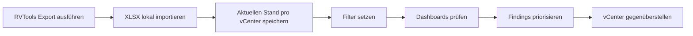
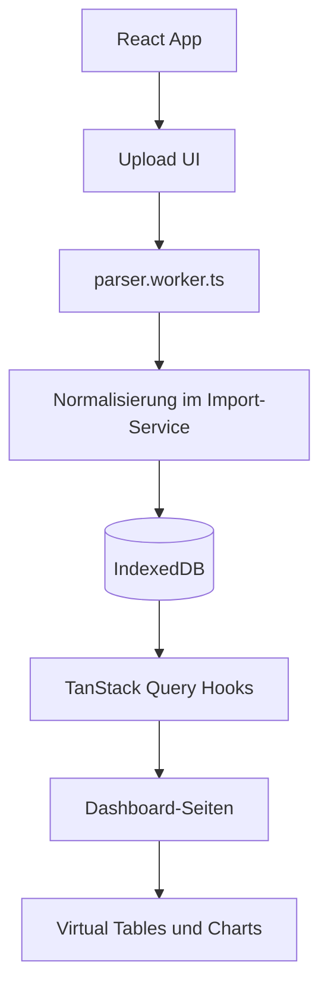

# RVTools Analyzer

<div align="center">

**Lokales Analyse-Dashboard für RVTools-Exporte aus VMware-Umgebungen**

Importiere RVTools-XLSX-Dateien, analysiere und vergleiche mehrere vCenter und finde operative Risiken, Kapazitätsengpässe, Lifecycle-Themen und Konfigurationsauffälligkeiten direkt im Browser.


</div>

---

## Für VMware-Admins

RVTools Analyzer ist für den Alltag von VMware-Administratoren gebaut: Inventur prüfen, Health-Themen priorisieren, Kapazitätsrisiken sichtbar machen und mehrere vCenter miteinander vergleichen.

Die Anwendung läuft vollständig clientseitig. Es gibt kein Backend, keinen Server-Upload und keine zentrale Datenbank. Importierte RVTools-Daten bleiben im Browser des jeweiligen Clients.

Für Betrieb, privates Hosting, Security, Datenschutz und Teststatus siehe [Technisches IT-Konzept](TECHNISCHES_IT_KONZEPT.md).

| Admin-Frage | Wo sie beantwortet wird |
|---|---|
| Welche VMs, Hosts, Cluster und Datastores sind im Scope? | **Overview** |
| Welche VM-Snapshots, Tools- oder Config-Themen brauchen Aufmerksamkeit? | **Daily Ops** |
| Wo werden Datastores knapp oder Cluster überbucht? | **Capacity** |
| Welche VMs zeigen CPU Ready, Memory Pressure oder Netzwerkauffälligkeiten? | **Performance** |
| Wo fehlen Backups, sind Pfade tot oder Partitionen voll? | **Storage / Backup** |
| Welche Portgroups, VLANs, dvSwitches und Security-Settings sind auffällig? | **Network / Security** |
| Welche Host-Uplinks, VMkernel-Adapter und pNICs sind relevant? | **Host-Netzwerk** |
| Welche ESXi-/vCenter-Versionen und Lifecycle-Themen sind sichtbar? | **Compliance / Lifecycle**, **VMware Versions** |
| Wie unterscheiden sich meine vCenter-Umgebungen? | **Fleet Compare** |

## Highlights

| Bereich | Nutzen |
|---|---|
| **RVTools-Import** | Upload von `.xlsx`/`.xls`, Fortschritt, Duplikaterkennung per SHA-256 und Verwaltung der importierten Stände |
| **Local-first** | Analyse ohne Backend; Daten liegen lokal in IndexedDB pro Browser-Origin |
| **Mehrere vCenter** | Je vCenter wird ein aktueller Stand verwaltet und gefiltert; verschiedene vCenter sind vergleichbar. Ein neuer Export ersetzt den bisherigen Stand desselben vCenters |
| **Admin-Dashboards** | Fokus auf Betrieb, Kapazität, Performance, Storage, Netzwerk, Security, Hardware, Lifecycle und Licensing |
| **Globale VM-Filter** | Feldbasierte Filter und Textsuche über den importierten Stand je vCenter |
| **Große Exporte** | XLSX-Parsing im Web Worker und virtuelle Tabellen für große RVTools-Dateien |
| **Tech-Info-Erweiterung** | Optionale Zuordnung zusätzlicher CMDB-/Betriebsdaten wie Wartungsfenster, SysV, Standort und Backup-Flag |

## Typischer Workflow



1. RVTools-Export aus der VMware-Umgebung erzeugen.
2. Datei unter **Uploads & Snapshots** importieren.
3. Optional weitere vCenter importieren. Ein erneuter Export desselben vCenters ersetzt dessen bisherigen Stand.
4. Über globale Filter den Scope eingrenzen, z. B. Cluster, OS, Power-State oder VM-Name.
5. Dashboards für Betrieb, Kapazität, Performance und Lifecycle prüfen.
6. Bei Bedarf mehrere vCenter im **Fleet Compare** gegenüberstellen.

## Schnellstart

### Voraussetzungen

- Node.js 18 oder neuer
- npm

### Lokal starten

```bash
npm install
npm run dev
```

Vite startet die Anwendung standardmäßig unter:

```text
http://localhost:5173
```

### Wichtige Befehle

| Befehl | Zweck |
|---|---|
| `npm run dev` | Lokaler Entwicklungsserver |
| `npm run build` | Production-Build nach `dist` |
| `npm run build:dev` | Development-Build |
| `npm run preview` | Gebauten Stand lokal prüfen |
| `npm run test` | Vitest-Tests ausführen |
| `npm run test:coverage` | Vitest-Tests mit V8-Coverage ausführen |
| `npm run lint` | ESLint ausführen |
| `npm run typecheck` | TypeScript-Projektprüfung ohne Emit |
| `npm run cf:login` | Cloudflare-Login via Wrangler |
| `npm run cf:pages:create` | Cloudflare-Pages-Projekt `rvtools` anlegen |
| `npm run cf:pages:deploy` | Production-Deploy nach Cloudflare Pages |
| `npm run cf:pages:deploy:preview` | Preview-Deploy nach Cloudflare Pages |

## Dashboard-Bereiche

| Route | Bereich | Fokus |
|---|---|---|
| `/overview` | Overview | Gesamtüberblick über VMs, Hosts, Cluster, Datastores und Health |
| `/upload` | Uploads & Snapshots | RVTools-Import, Tech-Info-Import, Fortschritt und Snapshot-Verwaltung |
| `/daily-ops` | Daily Ops | Health Events, VM-Snapshots, VMware Tools, Config Issues, verbundene Medien |
| `/capacity` | Capacity | Datastore-Headroom, vCPU/Core, Overcommit, Resource Pools, Hot Hosts |
| `/performance` | Performance | CPU Ready, Memory Pressure, Entitlement Gaps, FT und VM-Netzwerkauffälligkeiten |
| `/storage-backup` | Storage / Backup | Partitionen, Multipath, Dead Paths, Backup-Frische, RDM/VMFS-Indikatoren |
| `/network-security` | Network / Security | VM-Netzwerk, Portgroups, VLANs, Security-Policies und verwaiste Netze |
| `/host-network` | Host-Netzwerk | pNICs, vSwitches, VMkernel, dvSwitch-/dvPort-Sicht |
| `/hardware` | Hardware | Host-Hardware, Modelle, CPU-/RAM-Profile und Standardisierung |
| `/compliance` | Compliance / Lifecycle | Secure Boot, CBT, OS Drift, Tools Upgrade, ESXi Build Drift, NTP/DNS |
| `/licensing` | Licensing | Lizenznutzung, Editionen und Effizienzsicht |
| `/tech-info` | Tech-Info | Betriebsdaten je VM, z. B. Servertyp, Wartungsfenster, SysV und Backup-Flag |
| `/vmware-versions` | VMware Versions | Erkannte vCenter-/ESXi-Builds und Abdeckung bekannter Releases |
| `/fleet-compare` | Fleet Compare | Vergleich mehrerer vCenter-Umgebungen |

## Unterstützte Daten

### RVTools-Sheets

Der Import normalisiert zentrale RVTools-Daten und speichert nur Rohdaten, die in den Dashboards tatsächlich verwendet werden.

| Kategorie | Sheets |
|---|---|
| VM-Inventar und Betrieb | `vInfo`, `vTools`, `vSnapshot`, `vCPU`, `vMemory`, `vDisk`, `vPartition`, `vCD`, `vUSB` |
| Hosts und Cluster | `vHost`, `vHBA`, `vNIC`, `vSwitch`, `vPort`, `vSC_VMK` |
| Netzwerk | `vNetwork`, `dvSwitch`, `dvPort` |
| Storage | `vDatastore`, `vMultiPath` |
| Ressourcen und Lizenzen | `vRP`, `vLicense` |
| Quelle und Versionen | `vSource` |

### Tech-Info-Import

Zusätzlich kann eine Tech-Info-XLSX importiert werden. Erforderliche Spalten sind:

```text
Name, Wartungsfenster, Betriebssystem
```

Optionale Felder wie `Servertyp`, `Kommentar`, `SysV`, `SysV Abteilung`, `BZ`, `Schrankreihe`, `CV-Backup` und `AZ` werden in der Tech-Info-Sicht genutzt, sofern sie vorhanden sind.

## Datenhaltung und Datenschutz

| Thema | Verhalten |
|---|---|
| Speicherung | Lokal im Browser über IndexedDB |
| Backend | Nicht vorhanden |
| Upload zu Servern | Nicht vorhanden |
| Datenumfang | Pro Browser-Origin getrennt |
| Löschung | Einzelne Snapshots oder alle importierten Daten im Browser löschbar |
| Duplikate | Wiederholte Dateien werden per SHA-256 erkannt |

Wichtig für den Betrieb: Wenn die App unter einer anderen Domain, Subdomain oder einem anderen Port geöffnet wird, sieht der Browser dies als getrennten Origin. Die dort gespeicherten Snapshots sind deshalb separat.

## Architektur



| Ebene | Dateien / Technik |
|---|---|
| App und Routing | `src/App.tsx`, `react-router-dom` |
| Layout | `src/app/layout/*`, Sidebar, Theme |
| Domain-Modell | `src/domain/models/types.ts` |
| Import-Pipeline | `src/domain/services/importService.ts` |
| XLSX-Parsing | `src/workers/parser.worker.ts`, `@e965/xlsx` |
| Lokale Datenbank | `src/data/db/index.ts`, `idb` |
| Datenzugriff | `src/hooks/useActiveSnapshots.ts`, TanStack Query |
| Tabellen | `src/components/tables/VirtualTable.tsx`, TanStack Table/Virtual |
| UI | Tailwind CSS, shadcn/ui, Radix UI, lucide-react |
| Diagramme | Recharts |

## Projektstruktur

```text
src/
  app/layout/                 Layout, Sidebar, ThemeProvider
  components/
    dashboard/                KPI-Karten, Filterbar, Empty State
    global-filter/            GlobalFilterControl, Scope-Hinweise
    tables/                   VirtualTable
    ui/                       shadcn/ui-Komponenten
  data/db/                    IndexedDB-Schema und Zugriff
  domain/
    models/                   Zentrale Typen
    services/                 Import-Service und Normalisierung
  hooks/                      Daten- und Filter-Hooks
  lib/
    globalFilter/             Feldbasierter VM-Filter
    xlsx/                     Parse-Helfer
  pages/                      Analyse-Seiten
  workers/                    XLSX-Web-Worker
```

## Deployment

Das Projekt ist als statische Single-Page-App ausgelegt. Ein manueller Cloudflare-Pages-Workflow ist vorbereitet.

### Erstes Cloudflare-Setup

```bash
npm install
npm run cf:login
npm run cf:pages:create
```

`npm run cf:pages:create` legt ein Pages-Projekt namens `rvtools` mit `main` als Production-Branch an.

### Production-Deploy

```bash
npm run cf:pages:deploy
```

### Preview-Deploy

```bash
npm run cf:pages:deploy:preview
```

### Hosting-Hinweise

- Die App nutzt `BrowserRouter`. Das Hosting muss einen SPA-Fallback auf `index.html` unterstützen.
- Die Vite-Konfiguration ist aktuell für Deployment am Domain-Root ausgelegt.
- Bei Deployment unter einem Subpfad muss die Vite-Option `base` geprüft und angepasst werden.
- Importierte Daten bleiben immer lokal im Browser und werden nicht zwischen Domains oder Subdomains geteilt.

## Qualitätssicherung

| Check | Erwartung |
|---|---|
| `npm run test` | Tests mit Vitest ausführen |
| `npm run test:coverage` | Coverage für Logik-/Datenbereiche erzeugen |
| `npm run lint` | ESLint ausführen und neue Lint-Probleme vermeiden |
| `npm run typecheck` | TypeScript-Gate ausführen (`noImplicitAny` ist aktiv) |
| `npm run build` | Production-Build prüfen, besonders bei Änderungen an Build, Routing oder Hosting |

Aktueller lokaler Stand vom 05.07.2026: `npm run test` und `npm run test:coverage` laufen mit 17 Testdateien und 81 Tests grün; `npm run lint` läuft ohne Warnungen oder Fehler.

## Entwicklungsregeln

- Neue Seiten in `src/App.tsx` routen und in `src/app/layout/AppSidebar.tsx` verlinken.
- Änderungen am Datenmodell in `src/domain/models/types.ts` beginnen und danach Import-Service, DB und Hooks synchron halten.
- Bei IndexedDB-Schemaänderungen `DB_VERSION` erhöhen und Migrationen in `src/data/db/index.ts` pflegen.
- Datenzugriff bevorzugt über bestehende Hooks in `src/hooks/useActiveSnapshots.ts` umsetzen.
- Für große Tabellen `VirtualTable` verwenden.
- Importlogik bleibt clientseitig: Web Worker plus IndexedDB, keine Serverpersistenz.
- `@/*`-Alias statt tiefer relativer Pfade verwenden.
- Dateien als UTF-8 pflegen und deutsche Umlaute normal schreiben.

## Grenzen

RVTools Analyzer ersetzt kein Monitoring, kein vROps/Aria Operations und keine zentrale CMDB. Die App analysiert importierte RVTools- und Tech-Info-Snapshots. Aussagen hängen deshalb vom Stand und Umfang der importierten Dateien ab.

## Lizenz

Aktuell ist keine Lizenzdatei im Repository hinterlegt.
