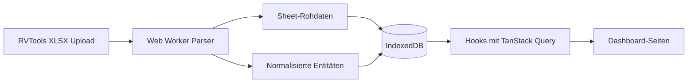

# 📊 RVTools Analyzer

<div align="left">


</div>

Lokales Analyse-Dashboard für RVTools-Exporte (`.xlsx`).
Die App importiert Snapshots, normalisiert die Daten clientseitig und stellt operative, kapazitive und Compliance-relevante Kennzahlen in mehreren Dashboards dar.

## 🧭 Inhaltsverzeichnis

- [✨ Features](#-features)
- [🧱 Tech Stack](#-tech-stack)
- [🚀 Schnellstart](#-schnellstart)
- [🖥️ Dashboard-Bereiche](#️-dashboard-bereiche)
- [🔄 Datenfluss](#-datenfluss)
- [📁 Projektstruktur](#-projektstruktur)
- [🧪 Qualitätssicherung](#-qualitätssicherung)
- [🔐 Datenschutz](#-datenschutz)
- [🤝 Entwicklung & Beiträge](#-entwicklung--beiträge)
- [📄 Lizenz](#-lizenz)

## ✨ Features

| Bereich | Highlights |
|---|---|
| 📥 Import | Upload von RVTools-Excel-Dateien (`.xlsx`, `.xls`), Duplikaterkennung via SHA-256, Fortschrittsanzeige |
| 🧠 Verarbeitung | Parsing im Web Worker, Normalisierung in Domain-Modelle, Speicherung in IndexedDB |
| 📊 Analyse | Mehrere Fachseiten (Overview, Daily Ops, Capacity, Performance, Storage/Backup, Network/Security, Hardware, Compliance, Licensing, Fleet Compare) |
| 🔍 Filterung | Snapshot-, vCenter- und Textfilter, automatische Auswahl des neuesten Snapshots je vCenter |
| ⚡ Performance | Virtuelle Tabellen (`@tanstack/react-virtual`) für große Datenmengen |
| 🎨 UI | React + Tailwind + shadcn/ui, helles/dunkles Theme |
| 🛡️ Lokalität | Kein Backend notwendig, Daten bleiben im Browser |

## 🧱 Tech Stack

| Kategorie | Tools |
|---|---|
| Runtime/Build | Vite, TypeScript |
| UI | React 18, Tailwind CSS, shadcn/ui (Radix) |
| State/Data | TanStack Query, lokale Filter-States |
| Tabellen/Charts | TanStack Table/Virtual, Recharts |
| Storage | `idb` (IndexedDB) |
| XLSX | `xlsx` |
| Tests | Vitest, Testing Library |
| Linting | ESLint + TypeScript ESLint |

## 🚀 Schnellstart

### Voraussetzungen

- Node.js 18+
- npm

### Installation & Start

```bash
npm install
npm run dev
```

Die App läuft anschließend lokal über Vite (Standard: `http://localhost:5173`).

### Weitere Befehle

| Befehl | Zweck |
|---|---|
| `npm run dev` | Entwicklungsserver |
| `npm run build` | Production-Build |
| `npm run preview` | Build lokal ansehen |
| `npm run test` | Unit-/Component-Tests (Vitest) |
| `npm run lint` | ESLint ausführen |

## 🖥️ Dashboard-Bereiche

| Route | Seite | Zweck |
|---|---|---|
| `/overview` | Overview | Globaler Überblick (VMs, Hosts, Datastores, Health) |
| `/upload` | Uploads & Snapshots | Import, Fortschritt, Snapshot-Verwaltung |
| `/daily-ops` | Daily Ops | Operative Auffälligkeiten (Config, Tools, Snapshots, Health) |
| `/capacity` | Capacity | Overcommit, Datastore-Headroom, Kapazitätsrisiken |
| `/performance` | Performance | CPU-Ready, Memory-Pressure, Entitlement-Gaps, NIC-/FT-Indikatoren |
| `/storage-backup` | Storage / Backup | Storage- und Backup-relevante Sicht |
| `/network-security` | Network / Security | Netzwerk- und Security-Perspektive |
| `/hardware` | Hardware | Host-/Hardware-bezogene Analyse |
| `/compliance` | Compliance / Lifecycle | Lifecycle- und Compliance-Indikatoren |
| `/licensing` | Licensing | Lizenz- und Effizienzsicht |
| `/fleet-compare` | Fleet Compare | Vergleich mehrerer Umgebungen/Snapshots |

## 🔄 Datenfluss



## 📁 Projektstruktur

```text
src/
  app/layout/                 # Layout, Sidebar, ThemeProvider
  components/
    dashboard/                # KPI-Karten, Filterbar, Empty State
    tables/                   # VirtualTable
    ui/                       # shadcn/ui Komponenten
  data/db/                    # IndexedDB Schema + Zugriff
  domain/
    models/                   # Zentrale Typen
    services/                 # Import-Service (Parsing/Normalisierung)
  hooks/                      # Daten- und Filter-Hooks
  pages/                      # Analyse-Seiten
  workers/                    # parser.worker.ts
```

## 🧪 Qualitätssicherung

| Check | Status im aktuellen Stand |
|---|---|
| `npm run test` | ✅ läuft |
| `npm run lint` | ⚠️ aktuell mit bestehenden Lint-Fehlern/Warnungen |

Hinweis: Die aktuellen Lint-Themen liegen u. a. bei `no-explicit-any`, `no-empty-object-type` und `no-require-imports`.

## 🔐 Datenschutz

- Alle importierten Daten werden lokal in IndexedDB gespeichert.
- Es gibt keinen serverseitigen Upload-Pfad im aktuellen Projekt.
- Snapshots können einzeln oder vollständig im Browser gelöscht werden.

## 🤝 Entwicklung & Beiträge

- Architekturregeln und Agenten-Kontext siehe `AGENTS.md`.
- Für neue Seiten immer Route in `src/App.tsx` und Navigation in `src/app/layout/AppSidebar.tsx` ergänzen.
- Domain-Änderungen zuerst in `src/domain/models/types.ts` umsetzen und danach Services/Hooks/DB nachziehen.
- Kodierung grundsätzlich in **UTF-8** pflegen.
- Umlaute normal schreiben (`ü`, `ä`, `ö`, `ß`), nicht als Umschreibung (`ue`, `ae`, `oe`, `ss`).

## 📄 Lizenz

Aktuell ist keine Lizenzdatei im Repository hinterlegt.
