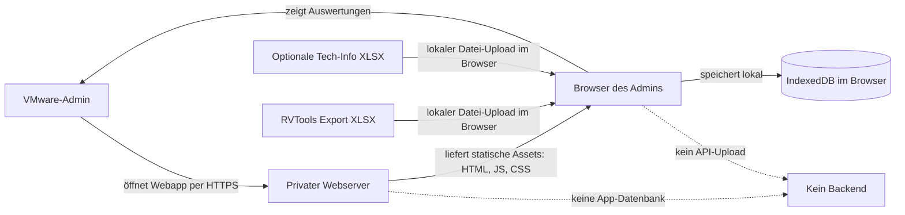
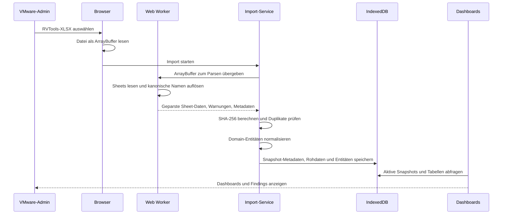
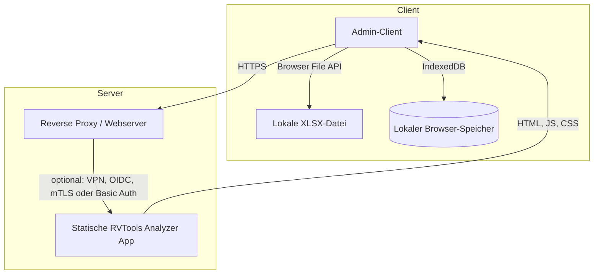

# Technisches IT-Konzept: RVTools Analyzer

Stand: 05.07.2026  
Zielgruppe: VMware-Administratoren, IT-Betrieb, IT-Security, Datenschutz, interne Freigabestellen  
Einsatzmodell: statisch gehostete Webanwendung auf einem privaten Server

## 1. Zweck des Dokuments

Dieses Dokument beschreibt, wie der RVTools Analyzer technisch arbeitet, welche Daten verarbeitet werden, wie die Anwendung betrieben werden kann und welche Sicherheits- und Datenschutzaspekte bei einer Nutzung in einer Firma zu beachten sind.

Ein technisches IT-Konzept für eine Webapp sollte mindestens folgende Punkte enthalten:

| Bereich | Inhalt |
|---|---|
| Ziel und Scope | Zweck der Anwendung, Zielgruppe, Abgrenzung |
| Systemarchitektur | Komponenten, Datenfluss, Laufzeitumgebung, Schnittstellen |
| Betriebskonzept | Hosting, Deployment, Updates, Backup, Monitoring |
| Datenkonzept | Datenarten, Speicherorte, Löschung, Aufbewahrung |
| Security-Konzept | Zugriffsschutz, Transportverschlüsselung, Browser-Sicherheit, Abhängigkeiten |
| Datenschutz | Personenbezug, Verantwortlichkeiten, technische und organisatorische Maßnahmen |
| Qualitätssicherung | Tests, Build, Linting, Coverage, bekannte Lücken |
| Risiken und Maßnahmen | Restrisiken, empfohlene Kontrollen vor produktivem Einsatz |

## 2. Kurzbeschreibung der Anwendung

RVTools Analyzer ist eine clientseitige Single-Page-App zur Analyse von RVTools-Exporten aus VMware-Umgebungen. VMware-Admins importieren lokal eine RVTools-XLSX-Datei und erhalten Dashboards zu Inventar, Betrieb, Kapazität, Performance, Storage, Netzwerk, Security, Hardware, Lifecycle, Licensing und vCenter-Vergleich.

Die Anwendung hat kein Backend und keine serverseitige Datenbank. Der Server liefert nur statische Dateien aus. Die importierten RVTools- und Tech-Info-Daten werden im Browser des jeweiligen Clients verarbeitet und in IndexedDB gespeichert.

## 3. Systemkontext



Wichtig: Der private Webserver erhält im normalen App-Betrieb keine importierten RVTools-Inhalte. Er stellt nur die Anwendung bereit. Die eigentliche Datenverarbeitung erfolgt im Browser.

## 4. Technische Architektur

| Komponente | Technologie / Datei | Aufgabe |
|---|---|---|
| App Shell | Vite, React 18, TypeScript, `src/App.tsx` | Routing, Provider, Layout |
| UI | Tailwind CSS, shadcn/ui, Radix UI, lucide-react | Oberfläche und Komponenten |
| Routing | `react-router-dom`, `BrowserRouter` | Clientseitige Navigation |
| Import-Service | `src/domain/services/importService.ts` | Importsteuerung, Fortschritt, Normalisierung |
| XLSX-Parser | Web Worker, `src/workers/parser.worker.ts`, `@e965/xlsx` | Parsing großer XLSX-Dateien außerhalb des UI-Threads |
| Datenmodell | `src/domain/models/types.ts` | Zentrale Domain-Typen |
| Lokale Datenbank | `idb`, `src/data/db/index.ts` | IndexedDB-Schema, Query- und Delete-Helper |
| Datenabfragen | TanStack Query, `src/hooks/useActiveSnapshots.ts` | Cache, Filterung, Snapshot-Auswahl |
| Tabellen | TanStack Table/Virtual | Performante Darstellung großer Tabellen |
| Diagramme | Recharts | KPI- und Diagrammvisualisierung |

## 5. Datenfluss beim Import



## 6. Gespeicherte Daten

### 6.1 Speicherorte

| Datenart | Speicherort | Serverpersistenz |
|---|---|---|
| Statische App-Dateien | Privater Webserver, z. B. Nginx/Caddy/Apache | Ja, aber ohne RVTools-Inhalte |
| RVTools-Snapshots | IndexedDB im Browser | Nein |
| Normalisierte VM-/Host-/Datastore-Daten | IndexedDB im Browser | Nein |
| Rohdaten ausgewählter RVTools-Sheets | IndexedDB im Browser | Nein |
| Tech-Info-Importe | IndexedDB im Browser | Nein |
| UI-State, Theme, Filter | IndexedDB und teilweise `localStorage` | Nein |
| Webserver-Logs | Webserver des Betreibers | Ja, je nach Serverkonfiguration |

### 6.2 IndexedDB-Schema

Die lokale Datenbank heißt `rvtools-analyzer`, aktuell mit `DB_VERSION = 16`. Sie enthält u. a. folgende Stores:

| Store | Inhalt |
|---|---|
| `snapshots` | Snapshot-Metadaten, vCenter-ID, Exportzeit, Dateiname, SHA-256 |
| `rawSheets` | Rohdaten ausgewählter RVTools-Sheets (kompakt als Wert-Arrays je Zeile) |
| `rawSheetHeaders` | Spaltenüberschriften der Rohdaten, einmal je Snapshot + Sheet |
| `entities_vm` | Normalisierte VM-Daten |
| `entities_host` | Normalisierte Host-Daten |
| `entities_cluster` | Normalisierte Cluster-Daten |
| `entities_datastore` | Normalisierte Datastore-Daten |
| `entities_snapshot` | VM-Snapshot-Daten |
| `entities_health` | Health-Ereignisse |
| `techinfo_imports` | Metadaten importierter Tech-Info-Dateien |
| `techinfo_rows` | Rohzeilen der Tech-Info-Dateien |
| `techinfo_latest` | Aktuellste Tech-Info je VM |
| `ui_state` | UI-Zustand, z. B. Filter |

## 7. Datenschutzbewertung

### 7.1 Verarbeitete Daten

RVTools-Exporte können sensible Infrastrukturinformationen enthalten, z. B.:

- VM-Namen, Hostnamen, Cluster, Datacenter, Folder und Resource Pools
- IP-/Netzwerkinformationen, Portgroups, VLANs, dvSwitch-Konfiguration
- Storage-, Datastore-, Multipath- und Backup-Indikatoren
- Betriebssysteme, VMware Tools, Hardwareversionen, ESXi-/vCenter-Builds
- Optional: Tech-Info-Daten wie Wartungsfenster, Verantwortliche, Abteilungen, Standort- oder Backup-Flags

Je nach Namenskonvention und Tech-Info-Inhalt können personenbezogene oder personenbeziehbare Daten enthalten sein, z. B. Admin-Kürzel, Verantwortliche, Abteilungen oder Systeme mit Personenbezug.

### 7.2 Datenschutzprinzipien

| Prinzip | Umsetzung / Bewertung |
|---|---|
| Datenminimierung | Nur tatsächlich genutzte RVTools-Rohsheets werden gespeichert; zentrale Entitäten werden normalisiert. |
| Zweckbindung | Nutzung zur lokalen VMware-Infrastruktur-Analyse. |
| Speicherbegrenzung | Snapshots können einzeln oder vollständig im Browser gelöscht werden. |
| Vertraulichkeit | Keine serverseitige Speicherung durch die App; Zugriff auf die Webapp muss über Hosting/Netz geschützt werden. |
| Integrität | Daten werden lokal aus importierten Dateien erzeugt; Duplikate werden über SHA-256 erkannt. |
| Transparenz | Das Konzept beschreibt Datenfluss, Speicherorte und Löschmöglichkeiten. |

### 7.3 Wichtige Einschränkung

Die App selbst erzwingt keine zentrale Löschfrist und keine Benutzerverwaltung. Bei Firmennutzung muss organisatorisch geregelt werden:

- Wer RVTools-Exporte importieren darf.
- Wie lange lokale Browserdaten auf Admin-Clients verbleiben dürfen.
- Ob Browserprofile verschlüsselt und Geräte zentral verwaltet sind.
- Ob Webserver-Logs IP-Adressen oder andere personenbezogene Daten enthalten und wie lange diese gespeichert werden.

## 8. Security-Konzept

### 8.1 Sicherheitsrelevante Eigenschaften der App

| Thema | Bewertung |
|---|---|
| Backend | Nicht vorhanden |
| API | Nicht vorhanden |
| Serverdatenbank | Nicht vorhanden |
| Authentifizierung in der App | Nicht vorhanden |
| Verarbeitung importierter Dateien | Lokal im Browser |
| Datei-Upload zum Server | Nicht vorhanden |
| Secrets im Frontend | Keine erforderlich |
| Duplikaterkennung | SHA-256 im Browser via `crypto.subtle.digest` |
| Persistenz | Browser-IndexedDB, getrennt pro Origin |

### 8.2 Zugriffsschutz

Da die Anwendung selbst keine Login-Funktion besitzt, muss der Zugriff auf dem privaten Server oder davor abgesichert werden. Für Firmennutzung wird mindestens eine der folgenden Varianten empfohlen:

| Variante | Geeignet für | Hinweis |
|---|---|---|
| VPN-only | Interne Admin-Tools | Webapp nur aus Admin-Netz erreichbar machen. |
| Reverse Proxy mit OIDC/SAML | Unternehmen mit SSO | Authentifizierung vor die statische App schalten. |
| mTLS | Kleine Admin-Gruppen mit Zertifikatsverwaltung | Starker technischer Zugriffsschutz. |
| Basic Auth über HTTPS | Kleine private Installation | Nur als einfache Mindestmaßnahme; Passwortmanagement beachten. |
| IP-Allowlisting | Ergänzende Maßnahme | Nicht als alleiniger Schutz ausreichend, wenn Netze geteilt sind. |

### 8.3 Empfohlene Security Header

Für den privaten Webserver sollten Security Header gesetzt werden:

```text
Strict-Transport-Security: max-age=31536000; includeSubDomains
X-Content-Type-Options: nosniff
Referrer-Policy: no-referrer
Permissions-Policy: camera=(), microphone=(), geolocation=()
Content-Security-Policy: default-src 'self'; script-src 'self'; worker-src 'self'; connect-src 'self'; img-src 'self' data:; style-src 'self' 'unsafe-inline'; base-uri 'self'; frame-ancestors 'none'; object-src 'none'
```

Hinweis zur CSP: `style-src 'unsafe-inline'` kann bei React-/Chart-Komponenten nötig sein, wenn Inline-Styles genutzt werden. Vor produktiver Härtung sollte die CSP im Zielbrowser getestet werden.

### 8.4 Transportverschlüsselung

Auch bei privatem Hosting sollte die Anwendung ausschließlich über HTTPS bereitgestellt werden. Das schützt:

- Zugriffsdaten des vorgeschalteten Logins.
- Integrität der ausgelieferten JavaScript-Dateien.
- Metadaten wie Pfade und Webserver-Anfragen.

Die RVTools-Dateien werden zwar nicht zum Server übertragen, aber die Anwendung selbst sollte trotzdem nicht unverschlüsselt ausgeliefert werden.

## 9. Betrieb auf einem privaten Server

### 9.1 Zielarchitektur



### 9.2 Deployment-Prinzip

Die App wird als statische Website gebaut:

```bash
npm install
npm run build
```

Der Inhalt des Ordners `dist` wird auf den privaten Webserver kopiert und dort als statische Site ausgeliefert.

Wichtig für das Hosting:

- Die App nutzt `BrowserRouter`.
- Der Webserver muss für unbekannte Pfade auf `index.html` zurückfallen.
- Bei Hosting unter einem Subpfad muss die Vite-Option `base` geprüft werden.
- Es ist keine Node.js-Laufzeit auf dem Zielserver nötig, wenn nur `dist` ausgeliefert wird.

### 9.3 Beispiel: Nginx-SPA-Fallback

```nginx
server {
  listen 443 ssl http2;
  server_name rvtools.example.internal;

  root /var/www/rvtools-analyzer/dist;
  index index.html;

  location / {
    try_files $uri $uri/ /index.html;
  }
}
```

Security Header, TLS-Zertifikate und Zugriffsschutz sind in diesem Minimalbeispiel noch zu ergänzen.

## 10. Qualitätssicherung und Tests

### 10.1 Aktueller Teststand

Frischer lokaler Testlauf:

```bash
npm run test
```

Ergebnis vom 05.07.2026:

| Kennzahl | Wert |
|---|---:|
| Testdateien gesamt | 17 |
| Testdateien bestanden | 17 |
| Tests gesamt | 81 |
| Tests bestanden | 81 |
| Tests fehlgeschlagen | 0 |
| Test-Runner | Vitest 3.2.6 |
| Testumgebung | jsdom |
| Dauer | ca. 9-14 s lokal |

Zusätzliche Gates:

| Befehl | Status |
|---|---|
| `npm run typecheck` | TypeScript-Projektprüfung läuft erfolgreich; `noImplicitAny` ist aktiv. |
| `npm run lint` | ESLint läuft ohne Warnungen oder Fehler. |
| `npm run build` | Production-Build läuft erfolgreich. |

### 10.2 Code Coverage

Aktueller Stand:

| Thema | Status |
|---|---|
| Coverage-Script in `package.json` | Vorhanden: `npm run test:coverage` |
| Coverage-Konfiguration in `vitest.config.ts` | Vorhanden, fokussiert auf `src/data`, `src/domain`, `src/hooks`, `src/lib`, `src/workers` |
| Coverage-Provider | `@vitest/coverage-v8` |
| Aktuelle Gesamt-Coverage | 51,93 % Statements, 66,37 % Branches, 67,74 % Functions, 51,93 % Lines |

Bewertung: Coverage ist nun messbar und im lokalen QS-Prozess ausführbar. Die Abdeckung ist für zentrale reine Logik bereits solide, insbesondere `clusterCapacityEngine`, `globalFilter`, `maintenance`, `parseHelpers`, `vmDetail`, `userDataBackup` und Teile der IndexedDB-Schicht. Niedrige Werte bestehen noch bei React-Hooks, Worker-Parsing, Backup-Service und Teilen des Import-Service.

Sinnvolle Mindestziele für dieses Projekt:

| Bereich | Empfehlung |
|---|---:|
| Parser- und Import-Helfer | 80 %+ |
| Globale Filterlogik | 80 %+ |
| Datenbank-Helper | 60 %+ |
| UI-Komponenten | Risikobasiert, Fokus auf kritische Workflows |

## 11. Bekannte technische Risiken

| Risiko | Bewertung | Maßnahme |
|---|---|---|
| Kein App-internes Login | Mittel bis hoch bei öffentlicher Erreichbarkeit | Zugriff über VPN, Reverse Proxy, SSO, mTLS oder mindestens Basic Auth schützen. |
| Noch keine Coverage-Grenzwerte in CI | Mittel | Coverage-Schwellenwerte nach Stabilisierung der Messbasis definieren und in CI erzwingen. |
| Sensible Infrastrukturdateien im Browser | Mittel | Nur verwaltete Admin-Geräte nutzen, Browserprofile schützen, Löschprozess definieren. |
| Webserver-Logs | Niedrig bis mittel | Logumfang und Aufbewahrung begrenzen; Datenschutz prüfen. |
| Dependency-Risiken im Frontend | Mittel | Regelmäßige Updates, `npm audit`, Build-Reproduzierbarkeit. |
| XSS über importierte XLSX-Inhalte | Mittel | React escaped Text standardmäßig; bei künftiger HTML-Ausgabe strikt vermeiden oder sanitizen. |
| Browser-Origin-Wechsel | Niedrig | Nutzer informieren: andere Domain/Subdomain bedeutet separater lokaler Datenbestand. |

## 12. Empfohlene Maßnahmen vor Firmennutzung

1. Zugriffsschutz vor die App schalten, bevorzugt VPN oder Reverse Proxy mit SSO.
2. HTTPS mit aktuellen TLS-Einstellungen erzwingen.
3. Security Header inklusive CSP konfigurieren und im Zielbrowser testen.
4. Webserver-Logs datenschutzkonform begrenzen.
5. Coverage-Erhebung über `npm run test:coverage` regelmäßig ausführen und Grenzwerte definieren.
6. `npm run typecheck`, `npm run test`, `npm run lint` und `npm run build` vor jedem Deployment ausführen.
7. Regelmäßige Dependency-Prüfung einführen, z. B. `npm audit` und kontrollierte Updates.
8. Interne Vorgabe zur Aufbewahrung und Löschung lokaler Browserdaten festlegen.
9. Admins darauf hinweisen, dass RVTools- und Tech-Info-Exporte sensible Infrastrukturinformationen enthalten.
10. Falls die App außerhalb eines geschlossenen Admin-Netzes erreichbar ist, Penetrationstest oder Security Review durchführen.

## 13. Abgrenzung

RVTools Analyzer ersetzt kein Monitoring, keine zentrale CMDB, kein SIEM und keine offizielle Compliance-Plattform. Die Anwendung analysiert importierte Snapshots. Ergebnisse sind daher abhängig von Aktualität, Vollständigkeit und Qualität der importierten RVTools- und Tech-Info-Dateien.

Die App speichert keine Daten zentral. Das ist aus Datenschutzsicht vorteilhaft, bedeutet aber auch:

- Kein zentraler Audit-Trail über importierte Dateien.
- Keine serverseitige Wiederherstellung importierter Snapshots.
- Keine automatische Synchronisierung zwischen Admins oder Geräten.
- Keine zentrale Durchsetzung von Löschfristen innerhalb der App.

## 14. Zusammenfassung für Freigabe

| Kriterium | Einschätzung |
|---|---|
| Betriebsmodell | Statische Webapp, privat hostbar |
| Serverpersistenz von RVTools-Daten | Nein |
| Verarbeitung | Lokal im Browser |
| Datenhaltung | IndexedDB pro Browser-Origin |
| Netzwerkkommunikation für importierte Daten | Keine App-seitige Übertragung an Server |
| Zugriffsschutz | Muss durch Hosting-Umgebung bereitgestellt werden |
| Teststatus | 81/81 Tests bestanden |
| Code Coverage | Eingerichtet; aktuelle Messung 51,93 % Statements für Logik-/Datenbereiche |
| Datenschutzrisiko | Beherrschbar bei geschütztem Hosting und geregeltem Umgang mit lokalen Browserdaten |
| Security-Reife | Für interne Nutzung geeignet, wenn Zugriffsschutz, HTTPS, Header und Updateprozess umgesetzt werden |
