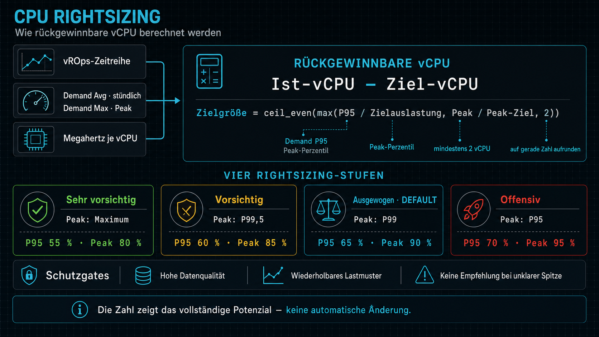
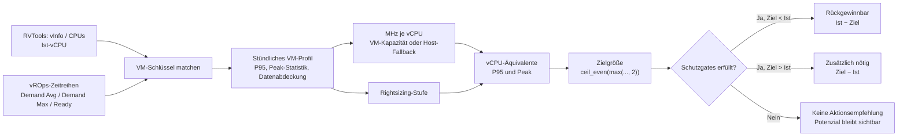

# CPU-Rightsizing

Technische Dokumentation der CPU-Rightsizing-Berechnung im RVTools Analyzer.

> **Kurz gesagt:** Aus historischen vROps-CPU-Demand-Zeitreihen wird zuerst ein
> bedarfsgerechtes vCPU-Ziel berechnet. Dieses Ziel wird durch eine konfigurierbare
> Rightsizing-Stufe, eine gerade Mindestgröße und Schutzgates gegen unsichere
> Muster abgesichert. Erst wenn die Gates erfüllt sind, wird daraus ein
> rückgewinnbarer oder zusätzlich benötigter vCPU-Betrag.



Die Infografik liegt als Repository-Asset unter
[`docs/assets/cpu-rightsizing-infographic.png`](assets/cpu-rightsizing-infographic.png).

## Inhaltsverzeichnis

- [Ziel und Begriffe](#ziel-und-begriffe)
- [Datenfluss](#datenfluss)
- [Eingabedaten](#eingabedaten)
- [Aufbereitung der Zeitreihe](#aufbereitung-der-zeitreihe)
- [Berechnungsschritte](#berechnungsschritte)
- [Rightsizing-Stufen](#rightsizing-stufen)
- [Schutzgates](#schutzgates)
- [Konkrete Beispiele](#konkrete-beispiele)
- [Aggregation und Interpretation](#aggregation-und-interpretation)
- [Was die Berechnung nicht aussagt](#was-die-berechnung-nicht-aussagt)
- [Implementierungsreferenzen](#implementierungsreferenzen)
- [Fachliche Quellen](#fachliche-quellen)

## Ziel und Begriffe

CPU-Rightsizing beantwortet die Frage:

> Wie viele vCPU braucht eine VM auf Basis ihres beobachteten CPU-Bedarfs, ohne
> die VM dauerhaft unnötig groß zu konfigurieren?

Die Berechnung ist eine **Entscheidungshilfe**, keine automatische Änderung an
einer VM. Die Zahlen beschreiben vCPU-Äquivalente innerhalb der normalisierten
VM-Kapazität; sie sind keine direkte Aussage über physische Kerne, NUMA-Grenzen
oder eine garantiert frei verschiebbare Host-Kapazität.

| Begriff | Bedeutung |
| --- | --- |
| `V_ist` | Aktuell konfigurierte vCPU-Anzahl der VM aus RVTools bzw. dem normalisierten VM-Inventar |
| `Demand` | Beobachteter CPU-Bedarf in MHz, nicht nur die CPU-Zeit im Gast |
| `M` | Normalisierte Kapazität pro vCPU in MHz (`mhzPerVcpu`) |
| `vCPU-Äquivalent` | `Demand / M`; der Bedarf ausgedrückt als Anteil einer vCPU |
| `V_bedarf` | Gerundete, stufenabhängige Zielgröße aus der Zeitreihe |
| `V_empfohlen` | Aktuelle Konfiguration nach Anwendung der Schutzgates |
| `Rückgewinnbar` | vCPU, die bei einer freigegebenen Verkleinerung rechnerisch entfallen können |
| `Zusätzlich nötig` | vCPU, die bei einer freigegebenen Vergrößerung rechnerisch fehlen |

### Aktueller Modellstand

Die Analyse weist direkt die vollständige Zielgröße aus. Ein separates Feld
**„Nächster Schritt“** oder eine gestufte Zwischenempfehlung gehört nicht mehr
zum aktuellen Rightsizing-Modell. Ebenso gibt es im Workload-Modell kein
eigenes Profil **„Grundlast mit Lastfenster“** mehr: flache Verläufe werden als
`constant`/„Dauerlast“ klassifiziert; ausreichend dominante Kalenderfenster
werden als `business-hours`, `night-batch` oder `weekend` erkannt.

## Datenfluss



Die zentrale Implementierung befindet sich in
[`src/domain/services/vmRightsizingService.ts`](../src/domain/services/vmRightsizingService.ts).
Die Zeitreihen werden vorher in
[`src/domain/services/vmWorkloadProfileService.ts`](../src/domain/services/vmWorkloadProfileService.ts)
zu VM-Profilen verdichtet.

## Eingabedaten

### Pflicht- und Fallback-Daten

| Datenquelle | Feld/Metrik | Verwendung |
| --- | --- | --- |
| RVTools | `vInfo.CPUs` bzw. normalisiertes `vcpu` | Aktuelle vCPU-Größe `V_ist` |
| vROps | `vmCpuDemandAvgMHz` | Stündlicher mittlerer CPU-Demand; liefert `D95` und die Fallback-Spitze |
| vROps | `vmCpuDemandMaxMHz` | Optionaler Intrastunden-Peak; liefert die stufenabhängige Peak-Statistik |
| vROps | `vmCpuTotalCapacityLastMHz` | Bevorzugte VM-Kapazität zur Ermittlung von MHz je vCPU |
| vROps | `vmConfiguredVcpuLast` | Bevorzugte vROps-vCPU-Anzahl zur Kapazitätsnormalisierung |
| vROps | `vmCpuReadyMaxPct` | Diagnose-/Kontextsignal; fließt nicht in die Zielgröße ein |
| Host-Inventar | `cpuTotalMHz / cpuCores` | Fallback für MHz je vCPU, wenn keine VM-eigene Kapazität vorliegt |

Die Import-Pipeline normalisiert die vROps-Werte bereits auf MHz, Prozent und
vCPU. Ein fehlender optionaler Peak verhindert die Berechnung nicht: Dann wird
das Maximum der stündlichen `Demand Avg`-Werte als Peak-Fallback verwendet.

### Warum CPU-Demand?

Für eine Kapazitätsrechnung wird der Demand als fachliche Bezugsgröße verwendet.
Er beschreibt den Ressourcenbedarf der VM einschließlich der für die Ausführung
relevanten physischen CPU-Ressourcen. Die grundlegende vROps-Beziehung lautet:

```text
CPU Workload (%) = CPU Demand (MHz) / CPU Total Capacity (MHz) × 100
```

Für das Rightsizing wird dieselbe Beziehung nicht als Prozentwert, sondern als
vCPU-Äquivalent verwendet:

```text
vCPU-Äquivalent = CPU Demand (MHz) / MHz je vCPU
```

## Aufbereitung der Zeitreihe

### 1. VM-Matching

RVTools-VMs und vROps-Objekte werden über den normalisierten Objekt-/VM-Schlüssel
zusammengeführt. Ohne gültige Ist-vCPU oder ohne verwertbare Demand-Daten kann
kein numerisches Rightsizing-Ziel entstehen.

### 2. Stündliches Raster

Die importierten Messpunkte werden auf ein stündliches Raster abgebildet. Für
jede VM entstehen unter anderem diese Reihen:

- `cpuDemandMHz` aus `vmCpuDemandAvgMHz`
- `cpuDemandMaxMHz` aus `vmCpuDemandMaxMHz`, falls vorhanden
- `cpuReadyPct` aus `vmCpuReadyMaxPct`
- Kapazität, konfigurierte vCPU, Co-Stop und Disparity aus den optionalen
  Kapazitätssignalen

### 3. Statistische Verdichtung

Für jede Metrik werden nur endliche Werte berücksichtigt. Die Werte werden
aufsteigend sortiert. Ein Perzentil `p` wird über den Index

```text
Index(p) = ceil(n × p) − 1
```

aus der sortierten Reihe gelesen und auf den gültigen Arraybereich begrenzt.
Dadurch sind `P95`, `P99`, `P99,5` und `Maximum` reproduzierbar und unabhängig
von fehlenden Messpunkten.

Die Datenabdeckung wird als

```text
coverageRatio = Anzahl gültiger Werte / erwartete Stundenslots
```

berechnet. Das Vertrauensniveau richtet sich ausschließlich nach Abdeckung und
Anzahl gültiger Werte:

| Vertrauensniveau | Bedingung |
| --- | --- |
| Nicht berechenbar | Keine gültigen Werte |
| Niedrig | Abdeckung `< 50 %` oder weniger als `24` Werte |
| Mittel | Abdeckung `≥ 50 %` und mindestens `24` Werte, aber Abdeckung `< 90 %` oder weniger als `96` Werte |
| Hoch | Abdeckung `≥ 90 %` und mindestens `96` Werte |

Für eine verkleinernde oder vergrößernde Empfehlung wird aktuell das Niveau
**hoch** benötigt.

### 4. Ermittlung von MHz je vCPU

Die Kapazitätsnormalisierung erfolgt in dieser Reihenfolge:

1. VM-eigene vROps-Kapazität geteilt durch die VM-eigene vROps-vCPU-Anzahl,
2. falls nicht verfügbar: Host-`cpuTotalMHz` geteilt durch Host-`cpuCores`,
3. falls beides nicht möglich ist: kein numerisches Ziel.

Formal:

```text
M = vmCpuTotalCapacityLastMHz / vmConfiguredVcpuLast
  oder
M = host.cpuTotalMHz / host.cpuCores
```

Die VM-eigene Kapazität hat Vorrang, weil eine VM im Messzeitraum auf einer
anderen Taktklasse oder einem anderen Host gelaufen sein kann als zum Zeitpunkt
des RVTools-Exports.

## Berechnungsschritte

### Schritt 1: Peak passend zur Rightsizing-Stufe auswählen

Aus `vmCpuDemandMaxMHz` wird je nach Policy-Stufe ein Peak-Perzentil gelesen.
Wenn diese Reihe fehlt, wird `Demand.maximum` als Fallback verwendet:

```text
D_peak = peakStatistic(DemandMax)
         oder Demand.maximum, falls DemandMax nicht vorhanden ist
```

Der mittlere Lastbedarf ist:

```text
D95 = Demand.p95
```

### Schritt 2: Demand in vCPU-Äquivalente umrechnen

```text
U95   = D95   / M
Upeak = D_peak / M
```

`U95` sagt, wie viele vCPU die VM bei ihrem normalen oberen Lastband benötigt.
`Upeak` schützt zusätzlich gegen kurze, aber wiederkehrende Spitzen.

### Schritt 3: Zielgröße für die ausgewählte Stufe berechnen

Jede Stufe definiert eine Zielauslastung für das P95- und das Peak-Signal. Das
Rohziel ist das Maximum aus beiden Anforderungen und der Mindestgröße von zwei
vCPU:

```text
T_raw = max(
  U95   / Zielauslastung_P95,
  Upeak / Zielauslastung_Peak,
  2
)
```

Danach wird immer auf die nächste gerade Zahl aufgerundet:

```text
V_bedarf = ceil_even(T_raw)
ceil_even(x) = ceil(x / 2) × 2
```

Das Aufrunden ist absichtlich konservativer als ein normales Aufrunden auf eine
beliebige Ganzzahl. Eine Zielgröße von beispielsweise `3` wird damit zu `4`.

### Schritt 4: Schutzgates anwenden

`V_bedarf` bleibt als rechnerischer Wert sichtbar. Er wird aber nur dann als
Änderungsempfehlung angewendet, wenn die Schutzgates erfüllt sind.

```text
Anwendbar = V_bedarf ist vorhanden
            und Datenvertrauen = hoch
            und Richtungsspezifische Gates sind erfüllt
```

### Schritt 5: Differenzen berechnen

Wenn die Empfehlung anwendbar ist:

```text
Rückgewinnbar   = max(V_ist − V_bedarf, 0)
Zusätzlich nötig = max(V_bedarf − V_ist, 0)
V_empfohlen     = V_ist − Rückgewinnbar + Zusätzlich nötig
```

Wenn ein Gate die Empfehlung zurückhält, bleiben `Rückgewinnbar` und
`Zusätzlich nötig` bei `0`; `V_empfohlen` bleibt auf der aktuellen Konfiguration
`V_ist`. Das verhindert, dass ein unsicheres Potenzial bereits in der
Kapazitätsaggregation als umsetzbare Einsparung erscheint.

## Rightsizing-Stufen

Die Stufen koppeln Peak-Statistik und Zielauslastungen. Standardmäßig wird
**Vorsichtig** verwendet.

| Stufe | Peak aus `Demand Max` | Zielauslastung P95 | Zielauslastung Peak | Charakter |
| --- | ---: | ---: | ---: | --- |
| Sehr vorsichtig | Maximum | 55 % | 80 % | Hohe Sicherheitsreserve; reagiert auf jede beobachtete Spitze |
| **Vorsichtig** | **P99,5** | **60 %** | **85 %** | **Standard: sehr geringe Ausblendung von Spitzen** |
| Ausgewogen | P99 | 65 % | 90 % | Ausgeglichenes Verhältnis von Reserve und Verdichtung |
| Offensiv | P95 | 70 % | 95 % | Höhere Verdichtung; nur bei gut verstandener Workload sinnvoll. In der Oberfläche mit einem roten Warnsymbol gekennzeichnet |

Die Stufe verändert nicht die Datenbasis und nicht das Workload-Profil. Sie
verändert nur, wie viel Reserve das Ziel gegenüber P95 und Peak einplant.

## Schutzgates

### Gates für alle Richtungen

- `D95` und `M` müssen numerisch vorhanden sein.
- Das Profil muss mindestens das Vertrauensniveau **hoch** haben:
  mindestens `96` gültige Werte und mindestens `90 %` Abdeckung.
- Eine Differenz von `0` erzeugt keine Änderungsempfehlung.

### Gates für Verkleinerungen

Eine Verkleinerung wird nicht empfohlen, wenn das Profil zu wenig über die
zeitliche Form aussagt:

| Workload-Form | Verhalten |
| --- | --- |
| `irregular` | Keine Verkleinerung; die beobachtete Spitze kann zufällig unterschätzt sein |
| `unclassified` | Keine Verkleinerung; die Datenbasis oder Klassifikation reicht nicht aus |
| `bursty` | Nur bei wiederholbarer Wochenstruktur: Korrelation `≥ 0,5` und Streuung der Wochenmaxima `≤ 0,4` |
| `constant`, `business-hours`, `night-batch`, `weekend`, `variable` | Bei hohem Vertrauen grundsätzlich zulässig; operative Prüfung bleibt erforderlich |

### Gates für Vergrößerungen

Eine einzelne kurze Spitze reicht nicht für eine Grow-Empfehlung. Das aktuelle
Profil muss mindestens **24 Stunden** über `75 %` der aktuell konfigurierten
Kapazität liegen. Der Test bezieht sich auf die heutige VM-Größe und nicht auf
eine historische Größe, die während des Messzeitraums bereits geändert wurde.

### Kontextsignale statt Formelbestandteile

Die folgenden Signale werden angezeigt und machen Kandidaten auffällig, ändern
aber die Zielgröße nicht direkt:

| Signal | Kennzahl im Modell | Schwelle |
| --- | --- | ---: |
| Viele vCPU bei geringer Nutzung | `V_ist ≥ 4` und P95-vCPU-Äquivalent `≤ 30 %` von `V_ist` | 30 % |
| Hoher CPU Ready | `ready.p95` | > 5 % |
| Co-Stop unter Last | P95 von Co-Stop in Stunden mit mindestens 25 % Kapazitätslast | > 5 % |
| Einzelkernbindung | Stunden mit gesättigtem höchstem Kern und VM-Lastreserve | ≥ 24 h |
| Konzentration auf wenige Kerne | `concentrationIndexP90` | ≥ 0,4 |

Insbesondere CPU Ready ist kein automatischer Beweis für eine zu klein
dimensionierte VM. Ready und Co-Stop beschreiben Scheduling-/Contention-
Effekte und müssen zusammen mit Host, Cluster, Gastbetriebssystem und Anwendung
bewertet werden.

## Konkrete Beispiele

### Beispiel 1: 8 vCPU, klar rückgewinnbar

Annahmen:

```text
V_ist    = 8 vCPU
M        = 1.000 MHz/vCPU
D95      = 2.000 MHz
D_peak   = 2.000 MHz
Stufe    = Ausgewogen
```

Berechnung:

```text
U95        = 2.000 / 1.000 = 2,0 vCPU
Upeak      = 2.000 / 1.000 = 2,0 vCPU

P95-Anteil = 2,0 / 0,65 = 3,08 vCPU
Peak-Anteil= 2,0 / 0,90 = 2,22 vCPU

T_raw      = max(3,08; 2,22; 2) = 3,08
V_bedarf   = ceil_even(3,08) = 4 vCPU
```

Bei hohem Vertrauen und einem zulässigen Workload-Profil:

```text
Rückgewinnbar   = 8 − 4 = 4 vCPU
Zusätzlich nötig = 0 vCPU
V_empfohlen     = 4 vCPU
```

### Beispiel 2: Peak bestimmt das Ziel

Annahmen:

```text
V_ist    = 16 vCPU
M        = 1.000 MHz/vCPU
D95      = 1.000 MHz
D_peak   = 5.400 MHz  (P99 aus Demand Max)
Stufe    = Ausgewogen
```

```text
U95         = 1.000 / 1.000 = 1,0 vCPU
Upeak       = 5.400 / 1.000 = 5,4 vCPU

P95-Anteil  = 1,0 / 0,65 = 1,54 vCPU
Peak-Anteil = 5,4 / 0,90 = 6,00 vCPU

T_raw       = max(1,54; 6,00; 2) = 6,00
V_bedarf    = ceil_even(6,00) = 6 vCPU
```

Die Spitze ist damit der bestimmende Faktor:

```text
Rückgewinnbar   = 16 − 6 = 10 vCPU
Zusätzlich nötig = 0 vCPU
V_empfohlen     = 6 vCPU
```

Dass der P95-Bedarf nur einer vCPU entspricht, reicht hier nicht für eine
kleine Zielgröße: Die wiederkehrende Peak-Statistik benötigt sechs vCPU, damit
die Zielauslastung von 90 % nicht überschritten wird.

### Beispiel 3: VM rechnerisch zu klein, aber Peak-only-Gate

Annahmen:

```text
V_ist       = 4 vCPU
M           = 1.000 MHz/vCPU
D95         = 1.800 MHz
D_peak      = 5.400 MHz
Stufe       = Ausgewogen
Stunden >75 % der aktuellen Kapazität = 3 h
```

```text
U95         = 1,8 vCPU
Upeak       = 5,4 vCPU
P95-Anteil  = 1,8 / 0,65 = 2,77 vCPU
Peak-Anteil = 5,4 / 0,90 = 6,00 vCPU
V_bedarf    = ceil_even(max(2,77; 6,00; 2)) = 6 vCPU
```

Das Ziel liegt über der aktuellen Größe, aber die VM war nur drei Stunden über
75 % ihrer aktuellen Kapazität. Das System wertet die Spitze deshalb als
`peak-only`:

```text
V_bedarf         = 6 vCPU  (sichtbarer Rechenwert)
Zusätzlich nötig  = 0 vCPU  (keine freigegebene Empfehlung)
V_empfohlen       = 4 vCPU  (aktuelle Größe bleibt unverändert)
```

Bei mindestens 24 Stunden über 75 % und hohem Datenvertrauen würden in diesem
Beispiel dagegen `2 vCPU` als zusätzlich nötig ausgewiesen.

### Beispiel 4: Großes Potenzial, aber unzuverlässiges Muster

```text
V_ist       = 16 vCPU
M           = 1.000 MHz/vCPU
D95         = 1.000 MHz
D_peak      = 1.000 MHz
V_bedarf    = 2 vCPU
Workload    = irregular
Vertrauen   = hoch
```

Das mathematische Ziel wäre klein, aber `irregular` ist für eine automatische
Verkleinerung nicht belastbar genug:

```text
Grund       = unreliable-shape
Rückgewinnbar   = 0 vCPU
V_empfohlen     = 16 vCPU
```

Das rechnerische Potenzial bleibt im Profil nachvollziehbar, wird aber nicht als
umsetzbare Einsparung aggregiert. Erst eine fachliche Prüfung oder ein besser
belegtes Muster rechtfertigt eine Änderung.

## Aggregation und Interpretation

### Einzel-VM

Die drei Werte sollten immer gemeinsam gelesen werden:

| Feld | Aussage |
| --- | --- |
| Bedarfsgerecht | Was die Messung und die gewählte Policy rechnerisch verlangen |
| Empfohlen | Welche Größe nach Schutzgates tatsächlich als Ziel ausgegeben wird |
| Rückgewinnbar | Positive Differenz zwischen Ist und anwendbarem Ziel |
| Zusätzlich nötig | Positive Differenz zwischen anwendbarem Ziel und Ist |
| Zurückhaltungsgrund | Warum ein rechnerisches Ziel nicht als Aktion angewendet wurde |

Beispiel: `Bedarfsgerecht = 6`, `Konfiguriert = 4`, aber `Empfohlen = 4` und
`Zusätzlich nötig = 0` bedeutet nicht, dass der Peak ignoriert wurde. Es bedeutet,
dass der Peak sichtbar ist, aber das Grow-Gate noch keine belastbare Änderung
freigibt.

### Gruppen und KPI

Für Cluster, Resource Pools, Workload-Formen und die sichtbare Tabellenmenge
werden die anwendbaren Werte summiert:

```text
Gruppen-Rückgewinnbar = Σ candidate.reclaimableVcpu
Rückgewinnbar (%)     = Gruppen-Rückgewinnbar / Σ V_ist × 100
```

Zurückgehaltene Kandidaten tragen `0` zur Rückgewinnungs-KPI bei. Dadurch bleibt
die KPI eine realistischere Umsetzungsgröße und nicht nur eine theoretische
Differenz aus einer einzelnen Statistik.

## Was die Berechnung nicht aussagt

- **vCPU ist nicht physischer Kern.** Hyper-Threading, CPU-Generation, NUMA,
  Co-Stop, Scheduling und die konkrete VM-Konfiguration beeinflussen die reale
  Wirkung einer Änderung.
- **Eine Rückgewinnung ist keine automatische freie Hostkapazität.** Erst die
  nachgelagerte Platzierungs- oder Clusteranalyse zeigt, wo die vCPU tatsächlich
  konsolidiert werden kann.
- **Ein niedriger Demand ist kein fachliches Freigabesignal.** Lizenzmodelle,
  Applikationshersteller, Gastbetriebssystem, Latenzanforderungen und geplante
  Lastspitzen müssen geprüft werden.
- **Ready ist kein Rightsizing-Eingang.** Hoher Ready kann auf Host- oder
  Cluster-Contention hinweisen; eine VM einfach zu verkleinern kann die Ursache
  verschärfen.
- **Die Zeitreihe ist historisch.** Nach einer Änderung sollte die VM erneut
  beobachtet werden. Ein einmaliges Rightsizing ersetzt kein laufendes
  Kapazitätsmanagement.

## Empfohlener operativer Ablauf

1. Analysezeitraum und Datenabdeckung prüfen.
2. Rightsizing-Stufe auswählen; für den Regelbetrieb zunächst **Vorsichtig**.
3. Kandidaten nach `Rückgewinnbar`, `Zusätzlich nötig` und Zurückhaltungsgrund
   sortieren.
4. Workload-Form und Kontextsignale prüfen: Peak-Wiederholung, Ready, Co-Stop,
   Kernkonzentration und Einzelkernbindung.
5. Gast-/Anwendungsowner, Lizenzierung und NUMA-/Topologieanforderungen
   einbeziehen.
6. Änderung in einem kontrollierten Wartungsfenster durchführen.
7. Nachbeobachtung gegen Demand, Ready, Co-Stop und Anwendungsmetriken ausführen.

## Implementierungsreferenzen

| Bereich | Datei |
| --- | --- |
| Formel, Policies, Schutzgates und Differenzen | [`src/domain/services/vmRightsizingService.ts`](../src/domain/services/vmRightsizingService.ts) |
| Profilbildung, Perzentile, Datenvertrauen und Workload-Form | [`src/domain/services/vmWorkloadProfileService.ts`](../src/domain/services/vmWorkloadProfileService.ts) |
| vROps-Metrikschlüssel und Einheiten | [`src/domain/models/types.ts`](../src/domain/models/types.ts) |
| Rightsizing-Panel und KPI-Aggregation | [`src/components/vm/VmRightsizingPanel.tsx`](../src/components/vm/VmRightsizingPanel.tsx) |
| Analyseexport einschließlich Rightsizing-Felder | [`src/lib/export/analysisExport.ts`](../src/lib/export/analysisExport.ts) |
| Fachliche Testfälle für Zielgrößen und Gates | [`src/domain/services/vmRightsizingService.test.ts`](../src/domain/services/vmRightsizingService.test.ts) |

## Fachliche Quellen

Die Implementierung orientiert sich an den vROps-/ESXi-Begriffen und den
folgenden Herstellerdokumenten:

- [Broadcom KB 382726 – CPU Workload und CPU Demand](https://knowledge.broadcom.com/external/article/382726)
- [Broadcom KB 433568 – CPU Demand als Sizing-Metrik](https://knowledge.broadcom.com/external/article/433568/using-netrun-as-a-primary-metric-for-vm.html)
- [Broadcom KB 387750 – CPU Ready und Co-Stop](https://knowledge.broadcom.com/external/article/387750/understanding-the-cpu-ready-values-in-th.html)
- [Broadcom KB 438023 – Rightsizing von VMs auf ESXi](https://knowledge.broadcom.com/external/article/438023/rightsizing-virtual-machines-on-esxi-80.html)
- [Broadcom KB 445643 – Erkennen und Bewerten inaktiver VMs](https://knowledge.broadcom.com/external/article/445643/identifying-and-reviewing-idle-virtual-m.html)

Die Herstellerquellen erklären die zugrunde liegenden Messgrößen. Die konkrete
Policy-Kopplung, die gerade Rundung, das 24-Stunden-Gate und die
Workload-Form-Gates sind projektspezifische Regeln des RVTools Analyzers.
