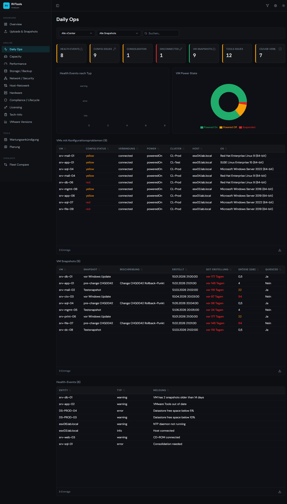
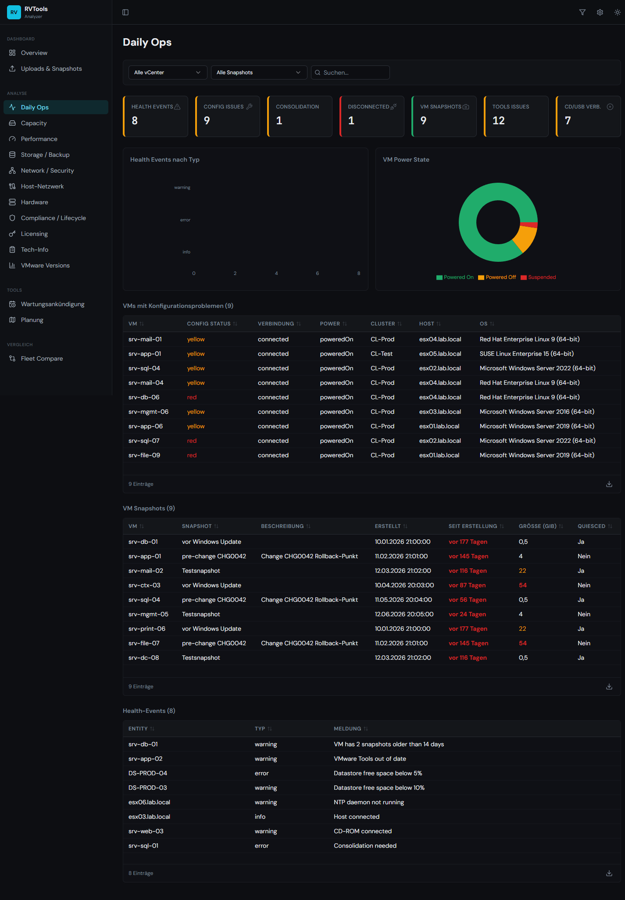
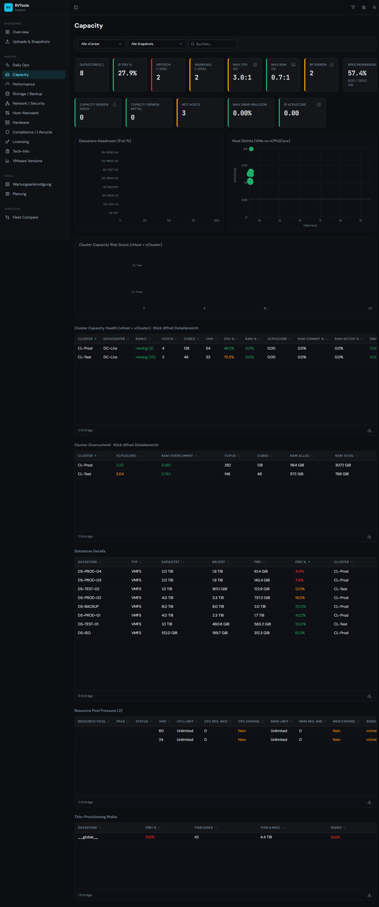
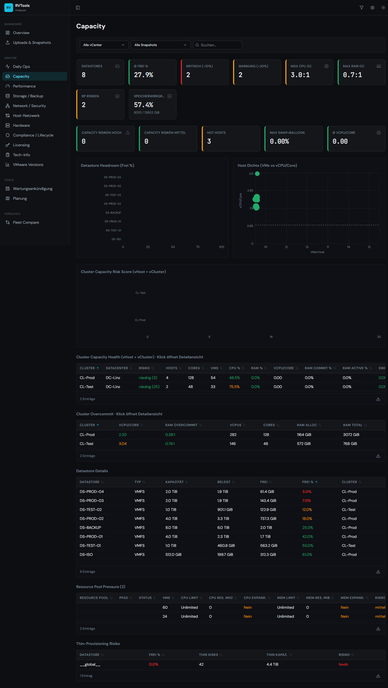
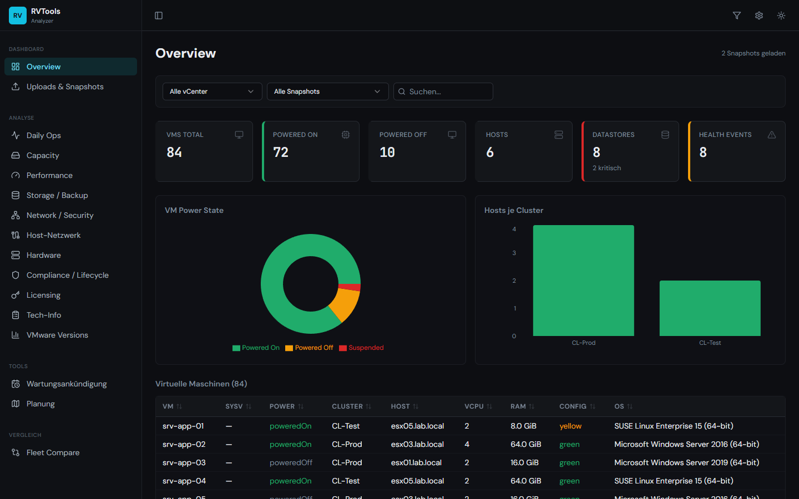
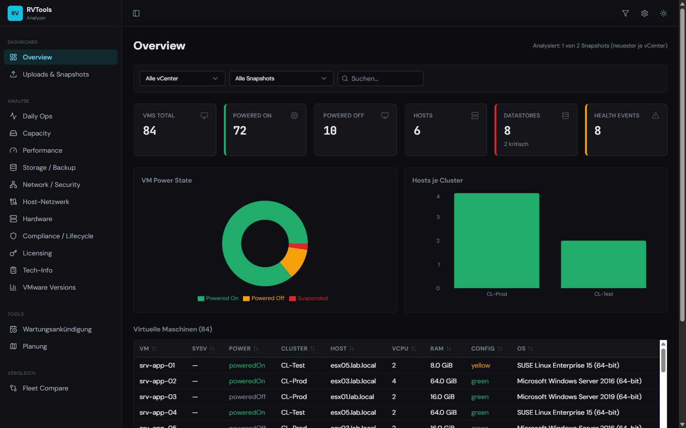

# Design-Audit RVTools Analyzer — 06.07.2026

Durchgeführt als Produkt-Design-Review mit echtem Browser-Walkthrough (Chrome) bei
1440 px (Desktop), 834 px (Tablet) und 390 px (Phone), in Dark- und Light-Theme.
Datengrundlage: zwei synthetisch generierte RVTools-Exporte (84 VMs, 6 Hosts,
2 Cluster, 8 Datastores, 2 Zeitstände) plus die realen Tech-Info-Vorlagen aus dem
Repo-Root. Der Testdaten-Generator kann bei Bedarf reaktiviert werden (Node-Skript
auf Basis von `@e965/xlsx`, Sheets analog `importService.ts`).

---

## 1. Taste-Baseline

**Produktintention (3 Zeilen):**

1. **Wer:** VMware-Administratoren, die RVTools-Exporte auswerten — Profis, die
   täglich vCenter, ESXi und Datastores betreuen und schnell Risiken triagieren wollen.
2. **Wofür:** Inventur prüfen, Health-/Kapazitäts-/Lifecycle-Risiken priorisieren,
   Zeitstände vergleichen — lokal im Browser, ohne Backend, ohne Datenabfluss.
3. **Charakter:** *Werkzeug*, nicht Editorial. Nüchtern, dicht, monospace-affin
   („Cockpit"-Ästhetik). Dark-first mit Cyan-Akzent passt zur Zielgruppe.

**Woran alles gemessen wird:** Ein gutes RVTools-Analyzer-Screen beantwortet in
< 5 Sekunden „Wo brennt es?" — Severity-Farben müssen bedeuten, was sie sagen
(rot = handeln), Zahlen müssen konsistent und Quellen nachvollziehbar sein, und
kein Pixel darf für Dekoration draufgehen, die die Triage verlangsamt.
Gradients, Glassmorphism, Emoji, dekorative Motion sind hier **nicht** verdient —
das einzige erlaubte Motion-Budget sind Zustandsübergänge (Hover, Fade-in beim
Seitenwechsel, Chart-Mount).

**Tokens/Design-System als Hypothese geprüft:** Die Token-Basis
(`src/index.css`, `tailwind.config.ts`) ist solide und konsequent genutzt —
HSL-Variablen, Severity-Farben (`success/warning/destructive/info`), Chart-Farben
über `chartStyles.ts`, DM Sans + JetBrains Mono. Die Dokumente (AGENTS.md) fordern
Token-Treue; das hält der Code weitgehend ein. **Das System ist nicht das Problem —
die Anwendung des Systems in drei Punkten schon:** starre KPI-Grids, fixe
Tabellenhöhen und Severity-Farben als kategoriale Palette (siehe unten).

---

## 2. Was verbessert wurde (nach Impact sortiert)

### 2.1 `VirtualTable`: Leerflächen eliminiert + Tastaturbedienung (Commit `55d95d7`)

**Problem (Design-Ceiling + Correctness):** Jede Tabelle hatte eine fixe Höhe
(300–500 px), unabhängig von der Zeilenzahl. Auf Daily Ops standen drei Tabellen
mit je 8–9 Zeilen in je ~500 px hohen Containern — über 1000 px toter schwarzer
Raum pro Seite, der Scanning und Vergleich massiv verlangsamt.
Zusätzlich waren Sortier-Header (`<th onClick>`) und klickbare Zeilen **nicht
tastaturerreichbar** — für die Detail-Dialoge gab es keinen Keyboard-Pfad.

**Fix:** Containerhöhe = `min(bisherige Höhe, Headerhöhe + Zeilen × 36 px)`;
Sortier-Header mit `tabIndex`, Enter/Space, `aria-sort` und sichtbarem Fokusring;
Zeilen mit `tabIndex` + Enter; Select-All als echter Button mit `aria-label`;
Fußzeile „1 Eintrag" statt „1 Einträge".

| Vorher | Nachher |
|---|---|
|  |  |

### 2.2 KPI-Karten: Clipping beseitigt, auto-fit-Raster (Commit `f05efff`)

**Problem (Correctness):** Die Seiten nutzten starre Raster bis `lg:grid-cols-9`.
Bei 1440 px wurde auf Capacity die Karte „Speicherwirkgrad" samt Wert
`8010 / 13952 GiB` durch `overflow-hidden` **unsichtbar abgeschnitten** — Inhalt
ging verloren, ohne dass man es merkt. Auf Storage/Backup kollidierten Icons mit
Labels („Partitionen", „Multipath Issues").

**Fix:** Neues `KpiGrid` (`repeat(auto-fit, minmax(10.5rem, 1fr))`) ersetzt alle
14 starren KPI-Raster; `KpiCard` truncated Titel/Wert/Untertitel mit
`title`-Tooltip, Icon bekommt `shrink-0`. Label „CD/USB verb." ausgeschrieben.

| Vorher | Nachher |
|---|---|
|  |  |

### 2.3 Irreführende Anzeigen korrigiert (Commit `20acd99`)

**Problem (Vertrauen = Kernwährung dieses Tools):**

- Capacity zeigte den internen Sentinel **`__global__`** als Datastore-Namen mit
  hartkodiertem, rotem „0.0 %" — eine erfundene Zahl in einem Risiko-Report.
- Compliance-Chart beschriftete Balken mit **„vmx-vmx-13"** (doppeltes Präfix)
  und färbte **jede** HW-Version < 20 rot — wenn alles rot ist, ist nichts rot
  (Alarm-Müdigkeit).
- VM-Detail zeigte RVTools-Sentinel **„-1"** als CPU/Mem-Limit.
- Overview-Kopf sagte „2 Snapshots geladen", analysiert wurde aber automatisch
  nur der neueste je vCenter — der Scope der angezeigten Zahlen war nicht erkennbar.

**Fix:** „Alle Datastores (gesamt)" mit Bewertung gegen den knappsten Datastore;
„vmx-13"-Labels + differenzierte Severity (vmx < 14 rot, < 19 gelb); „Unlimited"
statt „-1"; Scope-Zeile „Analysiert: 1 von 2 Snapshots (neuester je vCenter)".

| Vorher | Nachher |
|---|---|
|  |  |

### 2.4 A11y-Floor (in Commits 1 und 3 enthalten)

- Theme-Umschalter hatte **keinen zugänglichen Namen** → `aria-label`.
- Lösch-Buttons der Uploads waren `opacity-0` bis zum Hover → für Tastatur- und
  Touch-Nutzer unsichtbar/unerreichbar → jetzt dauerhaft sichtbar (dezent, 60 %).
- Zeilen-Checkboxen ohne Label → `aria-label`.

**Verifikation:** `npm run test` (85/85 grün), `npm run lint` (0 Findings),
`npm run typecheck` (sauber), `npm run build` (erfolgreich), alle Kernpfade
im Browser nachgeprüft.

---

## 3. L3-Vorschläge (nur Vorschlag, nicht umgesetzt)

1. **Navigation verdichten.** 15 flache Einträge in 4 Gruppen sind an der Grenze.
   Kandidaten: „VMware Versions" als Tab in „Compliance / Lifecycle" integrieren
   (dort existiert bereits ein vCenter-Versionsstand-Block); „Network / Security"
   und „Host-Netzwerk" unter einem Eintrag mit Tabs zusammenführen. Die
   Diagnose-Seite (`/upload/diagnostics`) ist nur über einen Button auf der
   Upload-Seite erreichbar — entweder in die Sidebar oder bewusst als
   „Entwickler-Werkzeug" dokumentieren.
2. **Kategoriale vs. Severity-Farben trennen.** `SEVERITY_COLORS` wird als
   kategoriale Chart-Palette missbraucht: „Suspended" ist rot (= kritisch?),
   „Powered Off" orange (= Warnung?). Power-State ist eine Kategorie, keine
   Severity. Vorschlag: neutrale kategoriale Palette (`--chart-*` existiert
   bereits!) für nominale Daten, Severity-Farben ausschließlich für bewertete
   Zustände. Betroffen: Overview, Daily Ops, Hardware, Compliance (Pies/Bars).
3. **Eine Zahl, eine Quelle.** „VMs gesamt" auf Hardware (Summe `# VMs` aus
   vHost = 87) widerspricht Overview (vInfo = 84). Auf Capacity zeigt „Cluster
   Capacity Health" 0.00 vCPU/Core, während „Cluster Overcommit" 2.20 zeigt
   (unterschiedliche Sheets als Quelle). Vorschlag: Zahlen mit abweichender
   Quelle als solche kennzeichnen („laut Host-Sicht") oder auf eine Quelle
   normalisieren — Widersprüche auf derselben Seite kosten Vertrauen.
4. **Globaler-Filter-Dialog: Copy handlungsorientiert machen.** „Filtern Sie
   Systeme über mehrere Quellen mit AND/OR-Gruppen…" erklärt das System statt
   der Aufgabe. Vorschlag: Beispiel-Chips („Nur Windows-Server in CL-Prod",
   „VMs ohne Backup") als Einstieg.
5. **Recharts-Mount-Animation deaktivieren** (`isAnimationActive={false}`):
   Bei jedem Seitenwechsel wachsen alle Balken/Pies neu — auf einem
   Monitoring-Tool wiederholte, informationsfreie Motion. Nebeneffekt: auch
   Screenshots/Exports zeigen nie halb-animierte Charts.

---

## 4. Korrektheitstabelle

| Seite | Viewport | Issue | Severity | Status |
|---|---|---|---|---|
| Capacity | Desktop 1440 | KPI-Karte „Speicherwirkgrad" + Wert unsichtbar geclippt (`overflow-hidden` + `lg:grid-cols-8`) | Hoch | ✅ Behoben (`f05efff`) |
| Storage/Backup | Desktop 1440 | 9er-KPI-Raster: Icon/Label-Kollision, Label-Clipping | Hoch | ✅ Behoben (`f05efff`) |
| Alle Analyse-Seiten | Alle | Fixe Tabellenhöhen erzeugen bis zu ~470 px Leerfläche pro Tabelle | Hoch | ✅ Behoben (`55d95d7`) |
| Alle Tabellen | Alle | Sortier-Header und klickbare Zeilen ohne Tastaturzugang, kein Fokusring | Hoch (A11y) | ✅ Behoben (`55d95d7`) |
| Capacity | Alle | Interner Sentinel `__global__` sichtbar, erfundenes rotes „0.0 %" | Hoch | ✅ Behoben (`20acd99`) |
| Compliance | Alle | Chart-Labels „vmx-vmx-13"; alles < vmx-20 rot (Alarm-Müdigkeit) | Mittel | ✅ Behoben (`20acd99`) |
| Header | Alle | Theme-Umschalter ohne zugänglichen Namen | Mittel (A11y) | ✅ Behoben (`20acd99`) |
| Upload | Alle | Lösch-Buttons nur bei Hover sichtbar (Tastatur/Touch: unerreichbar) | Mittel (A11y) | ✅ Behoben (`20acd99`) |
| VM-Detail | Alle | CPU/Mem-Limit zeigt rohes „-1" statt „Unlimited" | Niedrig | ✅ Behoben (`20acd99`) |
| Overview | Alle | Scope unklar („2 Snapshots geladen", analysiert wird 1) | Mittel | ✅ Behoben (`20acd99`) |
| Tabellen-Footer, Upload | Alle | „1 Einträge", „1 Sheets" (Plural bei Singular) | Niedrig | ✅ Behoben (`55d95d7`, `20acd99`) |
| Overview/Daily Ops | Alle | Power-State-Charts nutzen Severity-Farben für Kategorien (Suspended = rot) | Niedrig (Taste) | 📋 L3-Vorschlag 2 |
| Hardware vs. Overview | Alle | „VMs gesamt" 87 (vHost) vs. 84 (vInfo) ohne Quellenangabe | Mittel | 📋 L3-Vorschlag 3 |
| Capacity | Desktop | „Cluster Capacity Health" (0.00 vCPU/Core) widerspricht „Cluster Overcommit" (2.20) — andere Sheet-Quelle | Mittel | 📋 L3-Vorschlag 3 |
| Alle Seiten | Tablet 834 / Phone 390 | Kein horizontaler Seiten-Scroll; Sidebar wird auf Phone zum Sheet; Tabellen scrollen im Container | — | ✅ Pass |
| Overview (Light) | Desktop | Light-Theme konsistent, Chart-Tooltips nutzen Tokens | — | ✅ Pass |
| Dialoge (VM-Detail, Delete-All, Global-Filter) | Desktop | Fokus-Trap + Rückgabe via Radix, Escape schließt | — | ✅ Pass |
| Leere Zustände | Alle | Alle Seiten haben EmptyState mit Aktion; FleetCompare erklärt „mind. 2 vCenter" | — | ✅ Pass |
| Import-Flow | Desktop | Fortschritt, Duplikaterkennung, Warnungen (vFileInfo/vMetaData) sichtbar | — | ✅ Pass |

**Anmerkung zur Methodik:** Leere Chart-Flächen in Full-Page-Screenshots sind ein
Capture-Artefakt (Recharts-Mount-Animation startet beim Screenshot-Resize neu) —
im Live-DOM wurden alle Balken verifiziert. Siehe auch L3-Vorschlag 5.

## Nicht angefasst (bewusst)

- Farb-/Typo-Token, Sidebar-Design, Seitenstruktur: tragen den Werkzeug-Charakter
  gut; kein Umbau ohne Anlass.
- `Resource Pool Pressure` mit leeren Namen/Pfaden und Multipath „Active" in Rot
  im Audit-Datensatz: liegt an Spaltenabweichungen der synthetischen Testdaten
  (`Resource Pool name`, `Path 1 state`), nicht an der App — mit echten
  RVTools-Exporten gegenprüfen.
